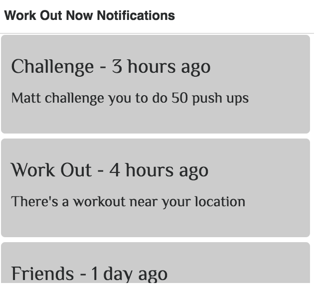
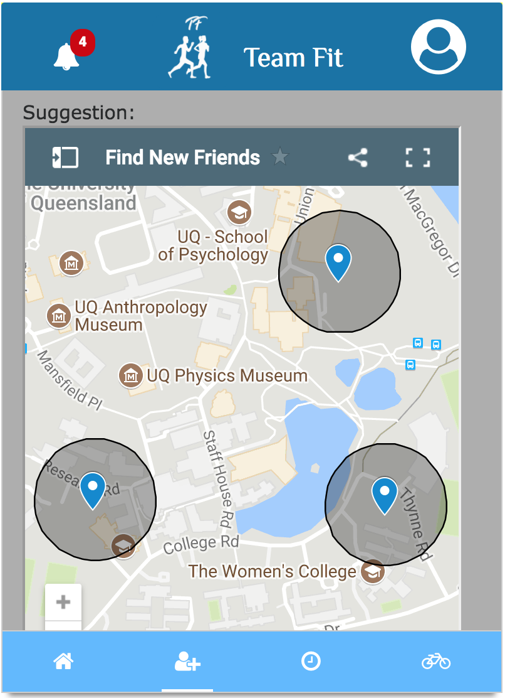

#Stand Up Evidence

# Work been done since last stand up:

Nipun:
- Worked on the challenge page
- In the challenge page people can challenge others for money contribution.

FeiSn:
-  Worked on the design of the homepage.
-  Finish the chating page in the prototype.
-  Find some suitable icons for the homepage buttons.

Kian:
- Work on the work out page.
- Added map to the work out page.
- Create Session in the workout page.

Andres:
- Work on the functionality and design of notifications feature.
- Changed overall color scheme of the prototype.
- Find a suitable font for all the text elements.
- Standarized the overall design of the whole prototype.

Alvin:
- Redesign the map due to the privacy problems
- Create sample datas for the searh friends results 
- Change the buttons that fit mobile application

# Next Task:

Nipun
- Make more Chanllenges available.
- Make posible challenge othe people.
- Conduct more user testings and put this prototype in front of users.

FeiSn
- Start doing the PPT for showcase
- Change some elements in the homepage.
- Finish the profile page.

Kian:
- Improve the work out page.
- Finalised the details and people are able to create a workout to the map.

Andres:
- Work on the promotional material.
- Refine the prototype
- User testing.
- Work on feedback receive today of improving the home page and overall desing.

Alvin:
- Design posters
- Collect feedbacks for the final prototype 
- fix up the prototype and contents 

